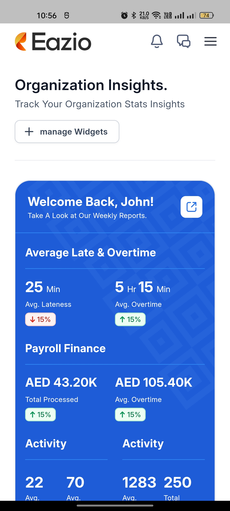
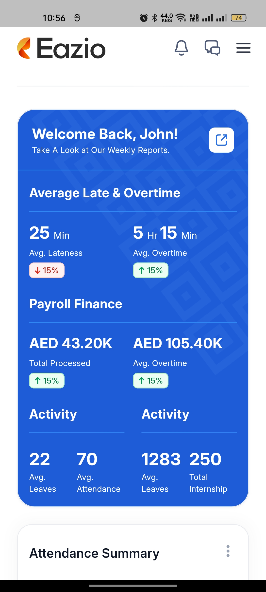
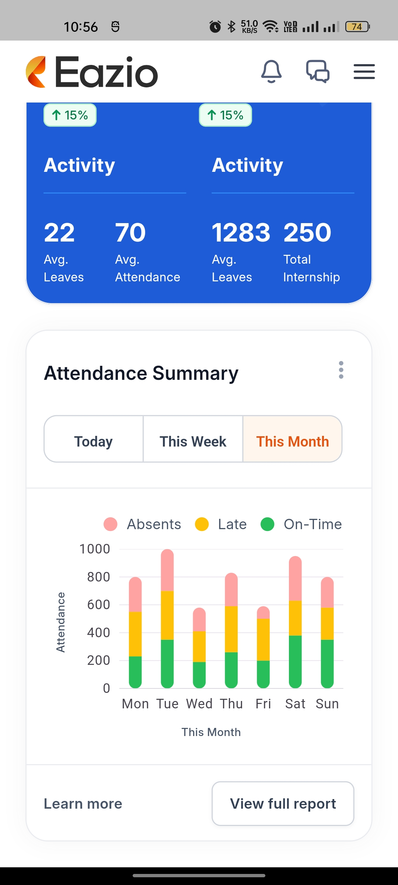

# Eazio Flutter Assessment

Eazio Flutter Assessment project built using **Flutter** and **Dart**. It implements the **MVC architecture** and uses **GetX** for efficient state management. The project also includes utility classes like **Utils**, **SizeUtils** for responsive design, **Extensions**, and various **Custom Widgets** for a cleaner, reusable, and maintainable codebase.

## Environment

 - Flutter 3.19.6
 - Dart 3.3.4

## Table of Contents

- [Features](#features)
- [Technologies](#technologies)
- [Architecture](#architecture)
- [Screenshots](#screenshots)

## Features

- **State Management**: Utilizes GetX for efficient state management, navigation, and dependency injection.
- **MVC Architecture**: Clean separation of logic with Model-View-Controller.
- **Responsive UI**: Custom utilities like `SizeUtils` ensure responsiveness across various screen sizes.
- **Custom Widgets**: Reusable custom widgets to maintain code reusability.
- **Extensions**: Handy Dart extensions to streamline and simplify the code.
  
## Technologies

- **Flutter**: The primary framework for building the mobile application.
- **Dart**: The programming language used to build the application.
- **GetX**: Used for state management, navigation, and dependency injection.
  
## Architecture

This project follows the **Model-View-Controller (MVC)** architecture pattern:

- **Model**: Manages the data of the application.
- **View**: Responsible for the UI and rendering widgets on the screen.
- **Controller**: Acts as the mediator between the Model and View, handling input and updating the view accordingly.

## Screenshots

